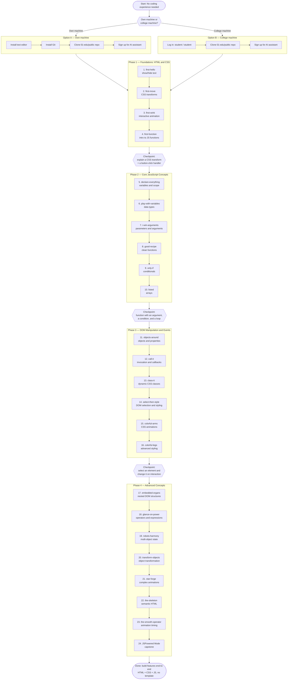

# AI.GO Roadmap

Visual learning path through the AI.GO curriculum (01-edu). Same content as [`WORKFLOW.md`](WORKFLOW.md), as a diagram instead of tables.

---

Haven't done the [setup](SETUP.md) yet? Do that first.
